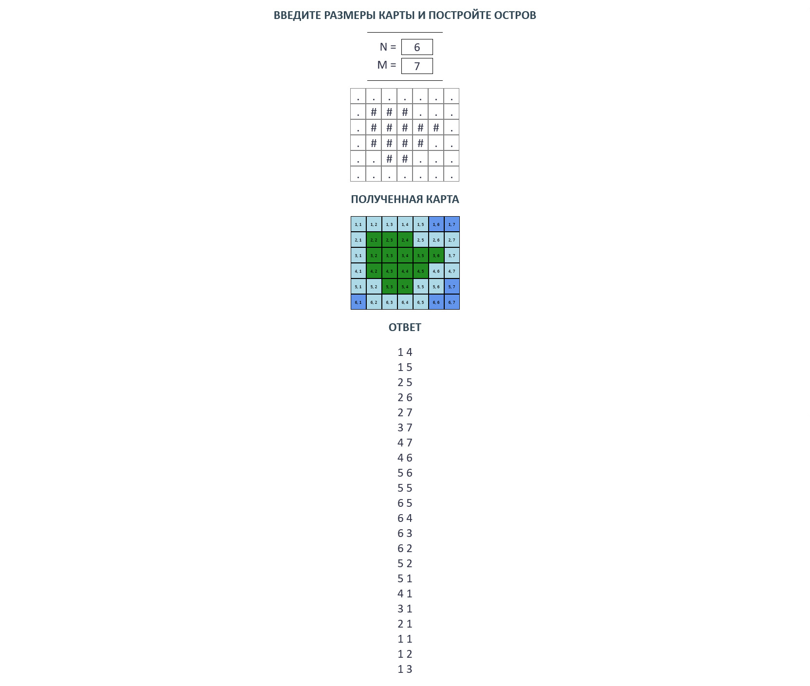

# Остров
## Постановка задачи
На клетчатой бумаге нарисована карта острова (клетки острова закрашены). При этом остров является клетчато-выпуклой фигурой, то есть каждая горизонтальная или вертикальная линия на карте либо не пересекает остров, либо пересекает его по отрезку (линия пересечения не содержит разрывов). Также остров является связной фигурой, то есть любые две клетки острова соединены путём, каждые две соседние клетки которого имеют общую сторону. 
 
Самолёт должен облететь вокруг острова по соседним с ним клеткам, не вторгаясь на территорию острова. Программа должна составить маршрут полёта самолёта. Самолёт начинает облёт острова в одной из соседних клеток с островом и должен побывать во всех клетках, соседних с островом, ровно один раз. При этом самолёт может перемещаться из одной клетки в другую клетку, только если эти клетки имеют общую сторону. 
 
Самолёт должен облететь вокруг острова по соседним с ним клеткам, не вторгаясь на территорию острова. Программа должна составить маршрут полёта самолёта. Самолёт начинает облёт острова в одной из соседних клеток с островом и должен побывать во всех клетках, соседних с островом, ровно один раз. При этом самолёт может перемещаться из одной клетки в другую клетку, только если эти клетки имеют общую сторону. 
 
На вход программа получает N и М, представляющие собой количество строк и количество столбцов на карте соответственно (3≤N≤100,3≤M≤100). 
Каждый символ карты может быть либо символом «.», что означает клетку, не принадлежащую острову, либо символом «#», что означает клетку острова. При этом остров не касается края карты. 
Введём на карте систему координат. Первая координата является номером строки, строки нумеруются сверху вниз числами от 1 до N. Вторая координата — номер столбца, столбцы нумеруются слева направо числами от 1 до M. 
 
Программа должна вывести координаты клеток карты в порядке их облёта самолётом. Каждая строка вывода должна содержать два числа x и y — координаты самолёта, записанные через пробел (1≤x≤N,1≤y≤M). 
Самолёт должен побывать в каждой соседней с островом клетке ровно один раз. Каждые две клетки, идущие подряд в выводе, должны иметь общую сторону. Можно вывести любой возможный маршрут облёта острова.
## Условные обозначения на карте
* **Тёмно голубым** цветом на карте обозначена вода. 
* **Зелёным** цветом на карте обозначен остров.  
* **Светло голубым** цветом на карте обозначен путь пилота вокруг острова.
## Пример работы программы

## Скриншоты работы программы

